# FEST OF HARMONY (FOH)

| WELCOME TO FOH(FEST OF HARMONY) |

 ----------------
 | Introduction |
 ----------------

Fest Of Harmony(FOH) is a contribution to hold up the glory of the village fair. It is a complete C++ based graphically designed system. This is a initial step in the field of graphics designing. Hope you will be able to realize the characteristics of the ancient fair in all these modern activities.

Thank you everyone.

>> YouTube video link: 

-------------------
| Required System |
-------------------

 >> Any version of windows operating system which is compatible to run CodeBlocks.
 >> CodeBlocks

--------------------------
| Minimum Specifications |
--------------------------

    1. Operating System : Windows® 7/8/10/11
    2. Processor		: Intel® Core™ i3
    3. Memory			: 1 GB RAM
    4. Graphics			: NVIDIA MX130
    5. Network			: Broadband Internet Connection
    6. Storage			: 500 MB

-------------------------------------------------
| How to run (Using .cpp extension) |
-------------------------------------------------

 >> Open "main.cpp" in the CodeBlocks.
 >> CodeBlocks will open the code for you.
 >> Press on the "Build & Run" option from the above toolbox.
 >> The system will be ready to use.

---------------------------
| How to run (Using .exe) |
---------------------------

 >> "FOH" is also available in .exe format.
 >> Just double tap on the .exe file to install.
 >> After installation, you are welcome to use SPI.

--------------------
| How to use "FOH" |
--------------------

 >> When the system starts to run, there will be a console based page where you may get all the necessary instructions to move the components in FOH.

---------------------------
| Background Informations |
---------------------------

The project FOH will be a nature-based project. There will be user control in some of the objects of the project. As it is a nature-based project, the main condition of the project was it should be more genuine and it should look real. There will be some Tents, Carts, A wheel, Stalls etc. Besides these, there will be some sound system of each and every component based on their real-life sounds. Rain and Snow can be added to make nature view more realistic and attractive. There should be a screen in this project to play a game. The game can be controlled by the user and there will be a term of point deduction, winning and losing.

----------------------------
| Developer's Informations |
----------------------------
	 1. Niloy Kanti Paul
		Email		: niloykantipaul@gmail.com
		LinkedIn	: https://www.linkedin.com/in/niloy-kanti-paul-5543181ab/
		Github		: https://github.com/DEV-NKP

	 2. Kaushik Biswas
		Email		: biswaskaushik.2020@gmail.com
		LinkedIn	: https://www.linkedin.com/in/kaushik-biswas-2b6554243/
		Github		: https://github.com/Kaushik-Biswas

	 3. Dipanwita Saha
		Email		: dipanwitasaha7009@gmail.com
		LinkedIn	: https://www.linkedin.com/in/dipanwita-saha-a772aa215/
		Github		: https://github.com/Dipanwita-Saha

	 4. Niger Sultana Nishi
		Email		: 
		LinkedIn	: 
		Github		: 

	 5. Shamsunnahar Riya
		Email		: 
		LinkedIn	: 
		Github		: 

----------------------
| Project Highlights |
----------------------

> At the very first, a landing page holding developer's information will be presented.
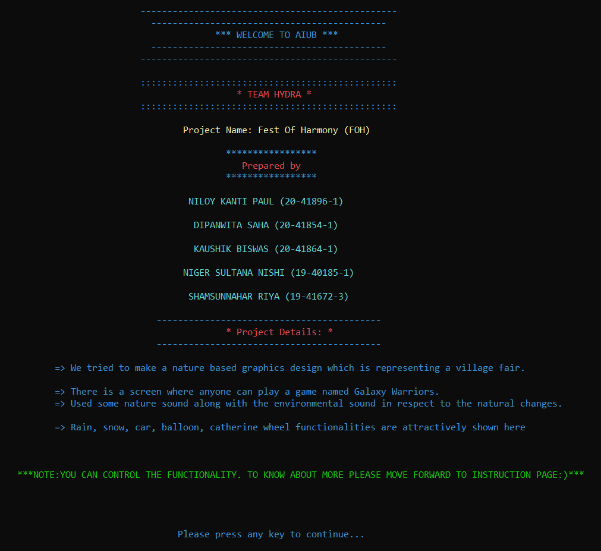

> In the next step, we may see the AIUB logo and the moto.
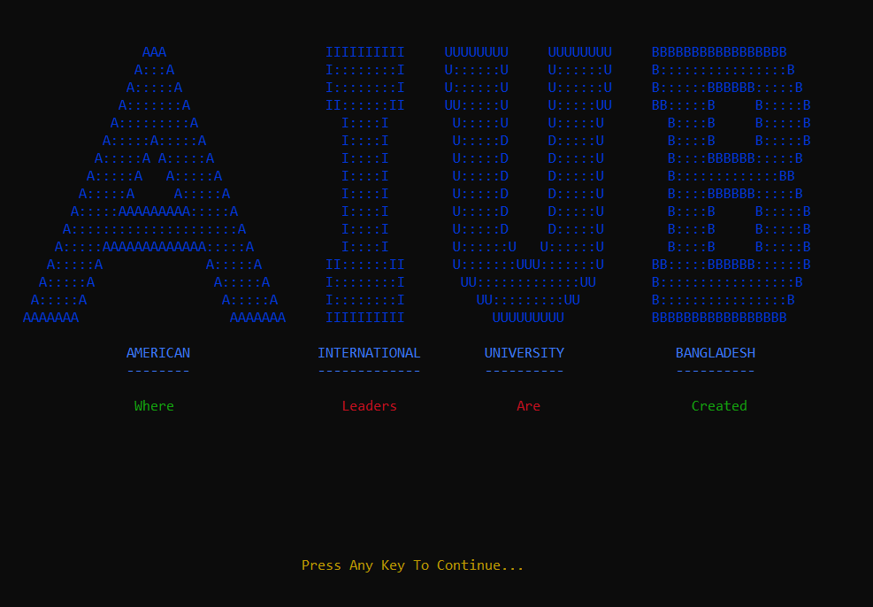

> FOH is designed with an unique and attractive logo.
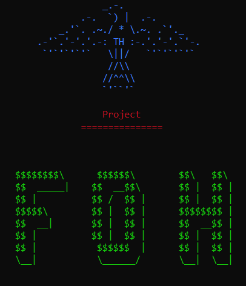

> Every instructions to run all the component is in detail in this page.
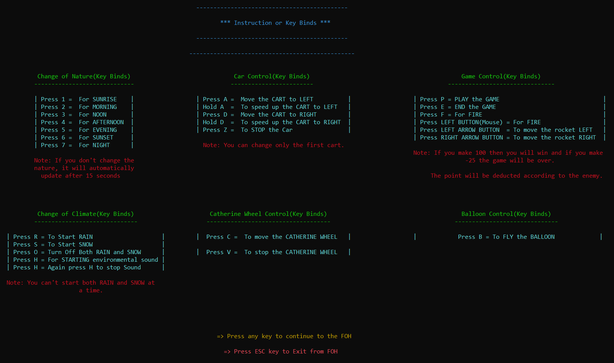

> There is a decorated nature view where you can feel the nature view of a village fair
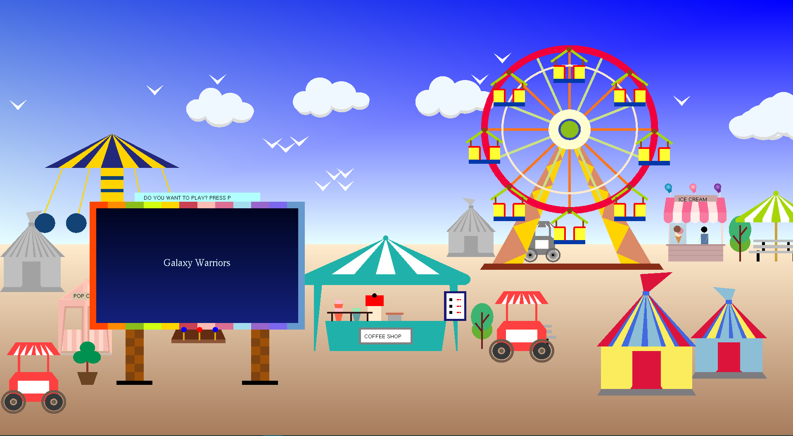

> To start and stop the "Catherine Wheel" press on "C" and "V".
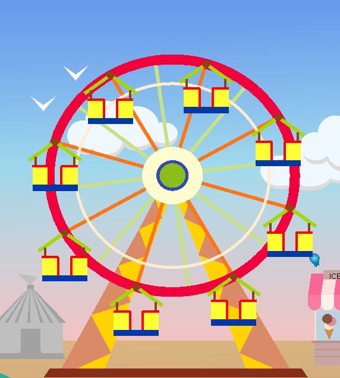

> You can play a game using "P" button.
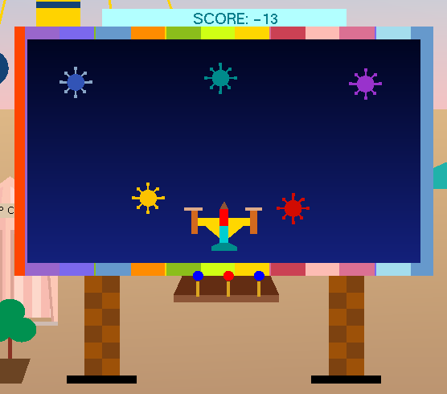

> A village fair is all about celebrations and celebration is not possible without a balloon. So to enable balloon you should press "B".
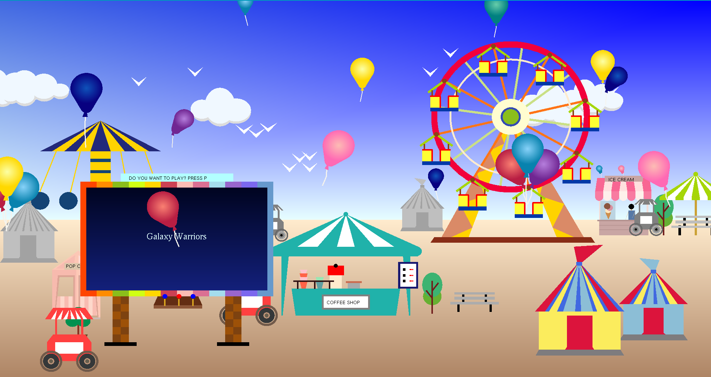

> Press "S" and "D" to move the car to right and left.
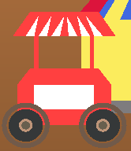

> Rain can be enabled with a press on "R" and to stop press on "O".
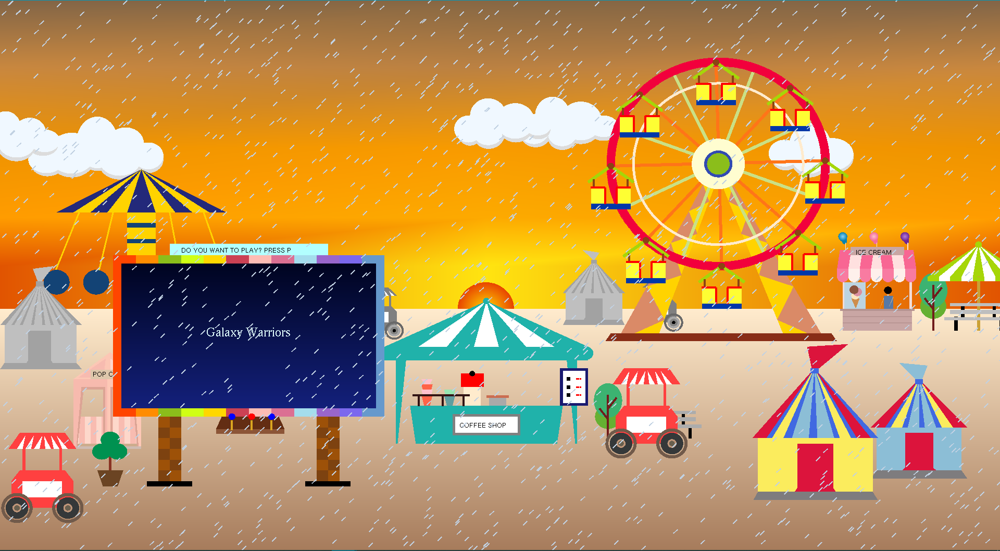

> To make the fair more realistic, we have added snow effect as well. To avail the snow effect, press on "S"
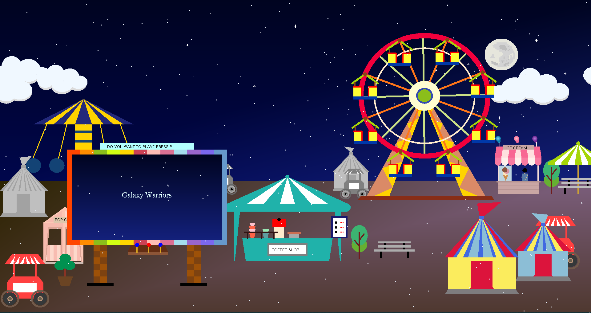

> If you are done exploring FOH, exit is designed for a lovely farewell.
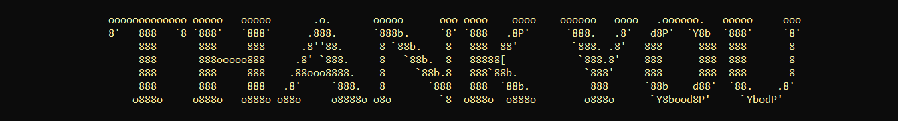

********************************************ⒸAll Rights Reserved By "TEAM_HYDRA"********************************************

